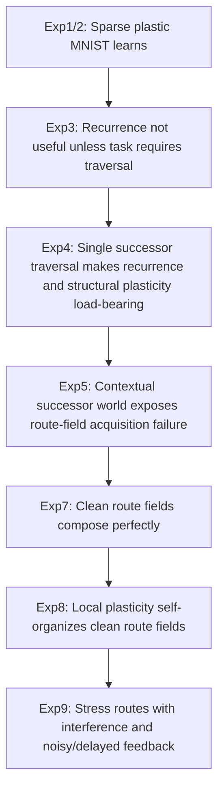

# Experiment Tracker

This document is the running ledger for the Biological Neural Nets project. It is meant to stay lightweight and current: what we planned, what we completed, what changed our mind, and what still needs to be tested.

Last updated: 2026-05-02

## Status Board

| Experiment | Status | Core question | Current takeaway | Main artifacts |
|---|---|---|---|---|
| Exp1 / Exp2 Sparse plastic MNIST | Completed | Can a sparse plastic substrate learn online at all? | Yes. Sparse/plastic variants can learn MNIST reasonably well, but MNIST alone is too shallow to prove recurrent traversal or biological-style computation. | `plastic_graph_mnist_exp1/`, `plastic_graph_mnist_exp2/`, `Experiment.md`, `ExperimentHandoff_1.md` |
| Exp3 Recurrent MNIST suite | Completed | Does recurrence help on MNIST, and does homeostasis matter? | Recurrence was measurable but not clearly useful on MNIST. Homeostasis mattered mainly when recurrence destabilized the substrate. | `plastic_graph_mnist_exp3/`, `ExperimentHandoff_1.md` |
| Exp4 Successor traversal | Completed | Can recurrent structural plasticity learn a reusable local transition and compose it? | Yes. This was the first task where recurrence and structural plasticity became clearly load-bearing. The task required traversal, not just classification. | `plastic_graph_mnist_experiment4_successor/EXPERIMENT_4_SUCCESSOR_TRAVERSAL.md`, `plastic_graph_mnist_experiment4_successor/analysis/exp4/` |
| Exp5 Contextual successor world | Completed / diagnosed | Can the graph choose among multiple transition systems based on context and suppress wrong routes? | Mechanistic partial success but not capability success. Recurrence was load-bearing; structural plasticity and context routing were partially load-bearing. The model preserved mode identity but did not reliably execute context-conditioned traversal. Main inferred failure: the route field did not become clean enough. | `plastic_graph_mnist_experiment5_contextual_successor/`, `EXPERIMENT_5_CONTEXTUAL_SUCCESSOR.md`, `analysis/exp5/` |
| Exp6 Multimodal number grounding | Deferred | Can shared number assemblies bind across modalities, then support traversal-based operations? | Deferred. The symbolic traversal stack needs robustness, interference, noisy reward, delayed credit, and adaptation tests before moving to multimodal grounding. | Planned future package |
| Exp7 Route Field Diagnostics | Completed | If the route field is clean, can recurrence compose it? | Yes. A clean context-conditioned route field composes perfectly. `no_recurrence` keeps one-step transition knowledge but fails composition. `no_context_binding` creates route collisions. `no_structural_plasticity` collapses near random. | `plastic_graph_mnist_experiment7_route_field_diagnostics/`, `analysis/exp7/` |
| Exp8 Self-Organizing Contextual Route Acquisition | Completed | Can a local plastic graph acquire a clean context-conditioned route field from one-step experience, then compose unseen paths? | Yes. With one-step-only training and no direct composition training, the full model reached 1.0 transition accuracy, 1.0 route-table accuracy, and 1.0 unseen composition accuracy across 30 seeds. `no_recurrence` learned one-step routes but failed composition; `no_structural_plasticity` was near random; `no_context_binding` produced route collisions; `context_bleed` degraded margins and long-path composition. | `plastic_graph_mnist_experiment8_self_organizing_route_acquisition/`, `analysis/exp8/` |
| Exp9 Robust Adaptive Route Plasticity | Implemented, local full run pending | Can routes survive interference, noisy feedback, delayed reward, and loss of eligibility traces? | Implemented and smoke-validated. The definitive local run is pending. This is the current active experiment. It should reveal whether inhibition, reward gating, and eligibility-like traces become load-bearing under the right stressors. | `plastic_graph_mnist_experiment9_robust_adaptive_route_plasticity/`, `start.ps1`, pending `analysis/exp9/` |
| Exp10 Rule Reversal / Adaptive Remapping | Planned | Can the graph adapt when transition rules change without total overwrite or interference? | Planned after Exp9. This should test stability-plasticity tradeoff, old-rule interference, remapping speed, and recovery after switching back. | Planned future package |

## Current Belief State

- Sparse plastic learning is viable, but simple classification is too shallow to test the thesis.
- Recurrence is not automatically useful. It becomes load-bearing only when the task genuinely requires traversal.
- Structural plasticity is now strongly implicated as the mechanism that forms usable route fields.
- Context binding is essential when multiple transition systems share the same source concepts.
- A clean route field is sufficient for recurrent composition.
- A clean route field can be self-organized from one-step local experience in the current symbolic number world.
- Inhibition is not needed for clean deterministic tasks, but it improves route purity and should become more important under interference.
- Reward gating is not needed under clean immediate feedback, but should become meaningful under noisy or delayed feedback.
- Homeostasis is not currently load-bearing in the stable symbolic settings, but remains relevant if recurrent drive becomes unstable.
- The next uncertainty is robustness, not clean capability: can the mechanism preserve, repair, and adapt routes when the environment becomes less clean?

## Key Result Chain



## Active Plan

1. Run the definitive local Experiment 9 suite.
2. Inspect whether inhibition protects correct-route margin and context margin under context bleed / interference.
3. Inspect whether reward gating protects route acquisition under noisy feedback.
4. Inspect whether eligibility-like traces protect learning under delayed reward.
5. If Exp9 is positive, implement Exp10 rule reversal / adaptive remapping.
6. Only after Exp9/Exp10 should we seriously return to Exp6 multimodal grounding.

## Minimum Analysis Standard For Each Future Experiment

Every experiment should report at least:

- `transition_accuracy`: one-step route learning.
- `composition_accuracy`: unseen multi-step recurrent traversal.
- `route_table_accuracy`: direct learned route-field inspection.
- `mean_target_rank`: whether the correct target is near the top even when argmax fails.
- `mean_correct_margin`: correct target score minus strongest wrong target.
- `mean_context_margin`: correct-mode support minus strongest wrong-mode support.
- `mean_wrong_route_activation`: competing route activity.
- Composition accuracy by path length.
- Composition accuracy by mode.
- Failure taxonomy: first-step failure, mid-route drift, no-recurrence single-step-only, context switch, or decoder/low-margin error.

## Logging Template

When we finish a new run or a meaningful interpretation pass, append a short entry like this:

```text
Date:
Experiment:
Run names:
Config highlights:
Key result:
What changed our belief:
Next action:
```

## Research Log

### Entry: Exp5 contextual successor world

```text
Date: 2026-05-02
Experiment: Exp5 Contextual successor world
Run names:
- exp5_full_contextual_traversal / exp5_smoke_full variants
- exp5_no_recurrence
- exp5_no_structural_plasticity
- exp5_no_context_routing
- exp5_no_reward_gate
- exp5_no_homeostasis
- exp5_no_inhibition
Config highlights: multiple mode-conditioned transition systems: plus_one, plus_two, minus_one; recurrence; structural plasticity; context routing; inhibition; reward gating; homeostasis ablations.
Key result: absolute composition accuracy stayed low. Recurrence was clearly necessary; structural plasticity and context routing helped directionally; context identity could be preserved even when final number composition failed.
What changed our belief: Exp5 likely failed because the route field never became clean enough, not because recurrent composition is impossible.
Next action: build a diagnostic route-field experiment to isolate route-field cleanliness from traversal mechanics.
```

### Entry: Exp7 route field diagnostics

```text
Date: 2026-05-02
Experiment: Exp7 Route Field Diagnostics
Run names:
- exp7_full_route_field
- exp7_no_recurrence
- exp7_no_context_binding
- exp7_no_structural_plasticity
- exp7_no_inhibition
- exp7_context_bleed
- exp7_noisy_plasticity
Config highlights: clean route-field diagnostic world; max_number=31; max_steps=8; one-step route table isolated from recurrent composition; no direct composition training needed for the diagnostic.
Key result: clean route fields composed perfectly. no_recurrence learned one-step transitions but failed composition. no_context_binding degraded through route collision. no_structural_plasticity collapsed near random. Context bleed weakened margins before destroying accuracy.
What changed our belief: recurrence can reliably compose a correct route field. Exp5's issue was route-field acquisition/cleanliness rather than recurrence itself.
Next action: test whether local plasticity can self-organize the route field instead of receiving a clean diagnostic field.
```

### Entry: Exp8 self-organizing contextual route acquisition

```text
Date: 2026-05-02
Experiment: Exp8 Self-Organizing Contextual Route Acquisition
Run names:
- exp8_full_self_organizing_route_field
- exp8_no_recurrence
- exp8_no_structural_plasticity
- exp8_no_context_binding
- exp8_no_inhibition
- exp8_no_homeostasis
- exp8_no_reward_gate
- exp8_context_bleed
Config highlights: one-step-only local transition training; transition exposure repeats=1; path_train_repeats=0; max_number=31; max_steps=8; 30 seeds; no direct multi-step composition training.
Key result: full model reached 1.0 transition accuracy, 1.0 route-table accuracy, and 1.0 unseen composition accuracy across 30 seeds. no_recurrence retained one-step knowledge but got 0.0 composition. no_structural_plasticity was near random. no_context_binding caused route collisions. context_bleed reduced margins and degraded long-path composition.
What changed our belief: the model can learn its way into the clean route fields that Exp7 showed were sufficient. Local context-bound structural plasticity can acquire reusable transition routes in this controlled symbolic world.
Next action: stress the mechanism with context interference, noisy feedback, delayed reward, and eligibility ablations.
```

### Entry: Exp9 robust adaptive route plasticity

```text
Date: 2026-05-02
Experiment: Exp9 Robust Adaptive Route Plasticity
Run names:
- exp9_interference_full
- exp9_interference_no_inhibition
- exp9_interference_no_context_binding
- exp9_interference_no_structural_plasticity
- exp9_feedback_full
- exp9_feedback_no_reward_gate
- exp9_feedback_no_eligibility_trace
- exp9_feedback_no_recurrence
- exp9_feedback_no_structural_plasticity
Config highlights: context-bleed sweep; feedback-noise sweep; reward-delay sweep; 30 seeds; max_number=31; max_steps=8; transition_train_repeats=1; path_train_repeats=0.
Key result: implemented and smoke-validated. Definitive local run pending.
What changed our belief: pending. This experiment is designed to determine whether inhibition, reward gating, and eligibility-like traces are actually load-bearing under stress.
Next action: run locally, upload `analysis/exp9/`, then decide whether to proceed to rule reversal/adaptation.
```
