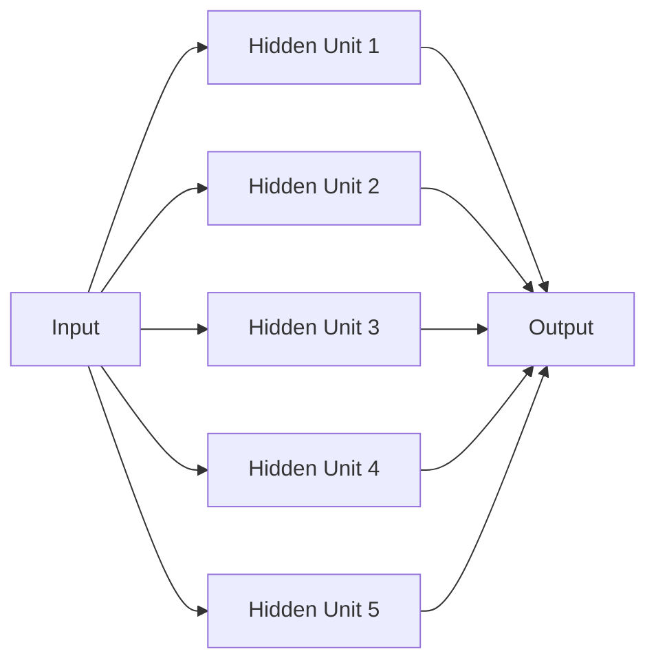
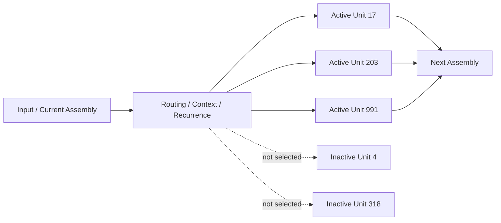

# Biological Neural Nets Experiment

A prototype research program for exploring **stateful, dynamically routed neural computation** inspired by biological nervous systems.

This repository contains experiments that compare conventional static computation against models where computation is an **activity-dependent trajectory through a population of latent computational units**. The current symbolic experiments focus on route formation, contextual route selection, recurrent traversal, and local structural plasticity.

The immediate goal is not to claim biological realism or prove a new learning paradigm. The goal is to build a disciplined experimental scaffold for asking a precise question:

> Can a neural system be made more biologically plausible, adaptive, sparse, and dynamically routed while still remaining trainable, interpretable, and eventually competitive on useful tasks?

---

## 1. Motivation

Most modern artificial neural networks are structurally simple compared with biological nervous systems.

A typical feed-forward neural network has:

- a fixed graph structure;
- fixed layer-to-layer connectivity during inference;
- a forward pass that computes activations but does not meaningfully alter the model's internal state;
- a training phase where parameters are adjusted, followed by an inference phase where the network is mostly static;
- dense matrix multiplication as the dominant computational abstraction.

Biological nervous systems exhibit:

- sparse activation;
- activity-dependent routing;
- state changes during information processing;
- synaptic plasticity;
- dynamic recruitment of neural circuits;
- recurrent and context-sensitive behavior;
- structural and functional adaptation over time.

The core hypothesis is that useful computational territory may exist between:

1. **Conventional artificial neural networks**, where the architecture is largely fixed and inference is mostly stateless; and
2. **Biological neural systems**, where computation, memory, routing, and plasticity are intertwined.

This project explores that middle ground.

---

## 2. Central Thesis

The central thesis of the project is:

> A neural network does not have to be understood only as a static stack of differentiable matrix operations. It can also be understood as a dynamic population of computational units through which inputs carve temporary, analyzable, and eventually adaptive paths.

The current stronger working claim, after Experiments 7 and 8, is:

> Local structural plasticity can form context-conditioned transition routes from sparse one-step experience, and recurrence can compose those learned routes into unseen multi-step behavior.

This does not replace conventional neural networks. It opens a research path toward models that combine:

- the trainability of artificial neural networks;
- the sparse activation of biological systems;
- the interpretability of explicit computational paths;
- the adaptability of stateful and plastic systems;
- the compositionality of recurrent traversal over learned route fields.

---

## 3. Conceptual Model

The project treats a hidden layer not as a fixed dense vector that always participates in the same way, but as a **large pool of possible computational units** from which a smaller active subset is selected or recruited.

In a conventional dense neural network, an input flows through all hidden units:



In the experimental model, the network contains many potential hidden units, but only a subset is active for a given input or route step:



This creates a distinction between:

- **Capacity**: the total number of available hidden units or route assemblies.
- **Active capacity**: the number of units used for a particular step.
- **Route field**: the learned context-conditioned mapping from a current assembly to the next assembly.
- **Traversal**: repeated recurrent use of the route field to move through a sequence.

---

## 4. From Sparse Paths To Route Fields

The earliest experiments focused on sparse dynamic paths through a latent population. Later experiments shifted into a symbolic number world because it gives us a clean way to test recurrence, route formation, and composition.

The current symbolic task family uses number concepts and mode-conditioned transition rules:

```text
plus_one:  n -> n + 1
plus_two:  n -> n + 2
minus_one: n -> n - 1
```

The same source can map to different targets depending on context:

```text
mode=plus_one,  source=4 -> 5
mode=plus_two,  source=4 -> 6
mode=minus_one, source=4 -> 3
```

Multi-step traversal then asks whether the system can repeatedly apply the chosen route:

```text
mode=plus_two, start=4, steps=4 -> 12
```

The correct path is:

```text
4 -> 6 -> 8 -> 10 -> 12
```

This task is deliberately simple, but it isolates the mechanism we care about: context-bound local routes plus recurrent composition.

---

## 5. Key Mechanisms Under Test

### 5.1 Recurrence

Recurrence turns one-step route knowledge into multi-step computation. Experiments 7 and 8 show the diagnostic pattern we want:

- with recurrence: learned local routes can compose;
- without recurrence: one-step transition knowledge can remain perfect while multi-step composition collapses.

### 5.2 Structural plasticity

Structural plasticity is the mechanism that forms route fields. When structural plasticity is removed, route acquisition collapses near random in Experiments 7 and 8.

### 5.3 Context binding

Context binding allows multiple transition families to coexist over the same source concepts. Without context binding, routes collide. The system may place the correct target near the top, but the margin collapses and recurrent traversal amplifies the ambiguity.

### 5.4 Inhibition

Inhibition is not required for clean deterministic tasks, but it improves route purity and should matter under interference. Experiment 9 is designed to test whether inhibition protects route margins under context bleed and overlapping route activation.

### 5.5 Reward gating

Reward gating is not load-bearing under clean immediate feedback, but should matter when feedback is noisy, misleading, or delayed. Experiment 9 tests this explicitly.

### 5.6 Eligibility-like traces

Delayed feedback requires assigning credit to earlier source/mode/target activity. Experiment 9 introduces delayed reward and a `no_eligibility_trace` ablation to test whether this mechanism matters.

### 5.7 Homeostasis

Homeostasis has mattered in earlier unstable recurrent settings, but it is not currently load-bearing in the stable symbolic route-field tasks. It remains important if future tasks create runaway recurrence, collapse, or pathological route concentration.

---

## 6. Experiment History

| Experiment | Question | Result |
|---|---|---|
| Exp1 / Exp2 Sparse plastic MNIST | Can sparse plastic substrates learn online at all? | Yes, but MNIST alone is too shallow to prove recurrent traversal. |
| Exp3 Recurrent MNIST suite | Does recurrence help on MNIST? | Recurrence was measurable but not clearly useful; the task did not force traversal. |
| Exp4 Successor traversal | Can recurrent structural plasticity learn and reuse a single transition chain? | Yes. Recurrence and structural plasticity became load-bearing once the task required traversal. |
| Exp5 Contextual successor world | Can the graph choose among multiple transition systems based on context? | Mechanistic partial success. Recurrence was necessary, but absolute composition was weak. The model preserved context identity but did not form a clean enough route field. |
| Exp6 Multimodal number grounding | Can number assemblies bind across modalities? | Deferred until the symbolic traversal stack is robust. |
| Exp7 Route Field Diagnostics | If a clean route field exists, can recurrence compose it? | Yes. Clean route fields compose perfectly. `no_recurrence` fails composition while preserving one-step route knowledge. |
| Exp8 Self-Organizing Route Acquisition | Can local plasticity acquire the clean route field from one-step experience? | Yes. One-step-only training produced perfect route-table and unseen composition accuracy across 30 seeds in the controlled symbolic world. |
| Exp9 Robust Adaptive Route Plasticity | Do inhibition, reward gating, and eligibility traces become load-bearing under stress? | Implemented and smoke-validated. Definitive local run pending. |
| Exp10 Rule Reversal / Adaptive Remapping | Can the graph adapt when rules change without catastrophic interference? | Planned after Exp9. |

---

## 7. Key Findings Through Experiment 8

### 7.1 Recurrence is only useful when the task requires traversal

The MNIST experiments did not make recurrence clearly useful. Successor traversal did. This suggests recurrence should not be evaluated in generic settings where the model can solve the task with static classification.

### 7.2 The model becomes interesting when paths matter

High accuracy alone is not enough. A high-accuracy model with collapsed or arbitrary paths would not support the thesis. The route-field diagnostics matter because they show interpretable transition structure.

### 7.3 Experiment 5 identified the right failure mode

Experiment 5 did not solve contextual traversal robustly. But it showed that recurrence mattered and that context identity could be preserved. The likely failure was route-field acquisition/cleanliness, not recurrent composition itself.

### 7.4 Experiment 7 isolated the traversal mechanism

Experiment 7 showed that clean route fields compose. It separated the question of **route-field correctness** from the question of **recurrent composition**.

### 7.5 Experiment 8 closed the acquisition gap

Experiment 8 showed that local context-bound structural plasticity can acquire a clean route field from one-step-only transition experience, then recurrence can compose that learned field into unseen multi-step paths.

### 7.6 Robustness is now the active frontier

The clean symbolic case is solved. The next question is whether the system remains stable under interference, noisy feedback, delayed reward, and rule changes.

---

## 8. Current Active Experiment: Experiment 9

Experiment 9 is **Robust Adaptive Route Plasticity**.

It has two main phases.

### Phase 9A: Context interference

Stressors:

```text
context_bleed = [0.0, 0.05, 0.10, 0.20, 0.35, 0.50]
```

Main variants:

- full model;
- no inhibition;
- no context binding;
- no structural plasticity.

Main question:

> Does inhibition protect route margins under interference, or is it cosmetic?

### Phase 9B: Feedback noise and delayed reward

Stressors:

```text
feedback_noise = [0.0, 0.05, 0.10, 0.20, 0.30]
reward_delay = [0, 2, 4]
```

Main variants:

- full model;
- no reward gate;
- no eligibility trace;
- no recurrence;
- no structural plasticity.

Main questions:

> Does reward gating protect route acquisition when feedback is unreliable?

> Do eligibility-like traces matter when reward is delayed?

---

## 9. Core Metrics

Every route-field experiment should report:

| Metric | Meaning |
|---|---|
| `transition_accuracy` | Whether one-step local routes are learned. |
| `composition_accuracy` | Whether learned one-step routes compose through recurrence. |
| `route_table_accuracy` | Direct inspection of the learned route field. |
| `mean_target_rank` | Whether the true target is near the top even when argmax is wrong. |
| `mean_correct_margin` | True target score minus strongest wrong target score. |
| `mean_context_margin` | Correct-mode support minus strongest wrong-mode support for the same target. |
| `mean_wrong_route_activation` | Bounded proxy for competing route activation. |
| composition by path length | Whether errors accumulate over longer traversals. |
| composition by mode | Whether some route families are easier or more fragile. |
| failure taxonomy | Whether failures occur at the first step, through mid-route drift, context switching, or missing recurrence. |

The most useful diagnostic pattern is not just accuracy. It is the relationship:

```text
route_table_accuracy -> correct/context margin -> composition by path length -> failure taxonomy
```

---

## 10. What Counts As A Strong Result Now?

A strong result after Experiment 8 should show:

1. The model trains only on one-step transitions.
2. It reaches high route-table accuracy.
3. It solves unseen multi-step composition.
4. Removing recurrence preserves one-step knowledge but destroys composition.
5. Removing structural plasticity destroys route acquisition.
6. Removing context binding causes route collisions.
7. Inhibition protects margin under interference.
8. Reward gating protects route acquisition under noisy feedback.
9. Eligibility traces protect delayed feedback learning.
10. Rule reversal can be handled without complete substrate destruction.

Experiments 7 and 8 establish points 1-6 in the clean symbolic world. Experiment 9 is designed to test points 7-9.

---

## 11. What Would Weaken The Direction?

The direction would look weaker if future experiments show that:

- robust composition only works when the route field is effectively hand-specified;
- local plastic acquisition fails under modest noise;
- inhibition never matters, even under strong interference;
- reward gating never matters, even under noisy/delayed feedback;
- rule reversal causes complete overwrite or irreversible interference;
- dense/static baselines solve the same tasks more simply while route diagnostics add no explanatory value;
- path metrics are tautological or derived from symbolic reset artifacts rather than actual recurrent trajectories.

---

## 12. Novelty Position

The safe novelty position is still cautious.

This project overlaps with:

- sparse neural networks;
- k-winners-take-all and top-k activation;
- conditional computation;
- mixture-of-experts routing;
- dynamic sparse training;
- Hebbian and plastic neural systems;
- graph neural networks and neural cellular automata;
- recurrent and state-space models.

The more defensible claim is not:

> We invented sparse neural networks.

The stronger claim is:

> We are exploring whether explicit, analyzable, stateful computational paths through a large neural population can provide a useful bridge between conventional artificial neural networks and biologically inspired adaptive neural systems.

The potentially interesting contribution is the combination of:

1. explicit route fields;
2. local structural plasticity;
3. context-bound transition families;
4. recurrent composition of learned local routes;
5. route-level diagnostics;
6. margin and failure-taxonomy analysis;
7. stress tests for interference, delayed reward, and adaptation.

---

## 13. Important Cautions

Avoid overclaiming.

Claims that are too strong right now:

- “This is how the brain works.”
- “This is fundamentally better than neural networks.”
- “This proves modern AI is architecturally wrong.”
- “This is a new kind of intelligence.”

More defensible claims:

- “This is a biologically inspired sparse routing and plasticity experiment.”
- “The model exposes active computational paths and route fields that can be analyzed directly.”
- “The architecture separates route acquisition from recurrent route composition.”
- “In symbolic traversal tasks, local structural plasticity can form context-conditioned routes that recurrence can compose.”
- “Further research is needed to establish novelty and usefulness beyond controlled symbolic domains.”

---

## 14. Current Repository Organization

The current experiment packages are intentionally isolated so that each experiment can evolve without corrupting earlier results.

```text
.
├── EXPERIMENT_TRACKER.md
├── Experiment.md
├── plastic_graph_mnist_exp1/
├── plastic_graph_mnist_exp2/
├── plastic_graph_mnist_exp3/
├── plastic_graph_mnist_experiment4_successor/
├── plastic_graph_mnist_experiment5_contextual_successor/
├── plastic_graph_mnist_experiment7_route_field_diagnostics/
├── plastic_graph_mnist_experiment8_self_organizing_route_acquisition/
└── plastic_graph_mnist_experiment9_robust_adaptive_route_plasticity/
```

Experiment 6 remains reserved/deferred for multimodal grounding. The numbering intentionally reflects the actual project conversation and generated packages rather than a perfectly sequential theoretical plan.

---

## 15. Running Current Experiments

Each recent experiment package includes a `start.ps1` that uses the shared virtual environment one directory up:

```powershell
$Python = Join-Path $ScriptDir "..\.venv\Scripts\python.exe"
```

For Experiment 9, the expected local flow is:

```powershell
cd .\plastic_graph_mnist_experiment9_robust_adaptive_route_plasticity
.\start.ps1
```

Then upload:

```text
analysis/exp9/
```

Most useful files:

```text
exp9_report.md
exp9_summary.csv
exp9_route_summary.csv
metrics_wide.csv
predictions.csv
route_diagnostics.csv
exp9_interference_*.png
exp9_feedback_*.png
exp9_failure_taxonomy.png
```

---

## 16. Research Log Template

Each experiment should record:

```text
Experiment name:
Date:
Code commit:
Dataset/task:
Configuration:
Variants/ablations:
Seeds:
Training exposure:
Composition exposure:
Hidden units:
Assembly sizes:
Plasticity settings:
Context settings:
Reward settings:

Primary results:
- Transition accuracy:
- Route-table accuracy:
- Composition accuracy:
- Composition by path length:
- Composition by mode:

Route diagnostics:
- Mean target rank:
- Mean correct margin:
- Mean context margin:
- Mean wrong-route activation:
- Failure taxonomy:

Interpretation:
- What worked?
- What failed?
- Which mechanism was load-bearing?
- Which mechanism remained untested?
- Did anything collapse?
- What should change next?
```

---

## 17. Next Research Deliverables

Near-term:

1. Analyze Experiment 9 results.
2. Implement Experiment 10 rule reversal / adaptive remapping if Exp9 supports the mechanism under stress.
3. Write a route-field metrics specification document.
4. Write a formal novelty review comparing this work against sparse networks, MoE, dynamic sparse training, Hebbian plasticity, graph neural networks, neural cellular automata, and recurrent state-space models.

Medium-term:

1. Test larger symbolic worlds with more operations.
2. Test route acquisition with partial observability and noisy sensory grounding.
3. Revisit multimodal number grounding.
4. Integrate image-derived number concepts only after symbolic route robustness is understood.
5. Explore persistent local node state and bounded forward-pass plasticity.

---

## 18. Final Framing

This project should remain disciplined.

The point is not to prematurely declare a breakthrough. The point is to build a system where we can carefully investigate whether dynamic, sparse, path-based neural computation gives us something meaningfully different from conventional dense neural networks.

The model becomes interesting only if the paths matter.

If the paths are stable, interpretable, adaptive, efficient, and predictive, then the approach deserves deeper investigation.

If the paths are random, collapsed, unstable, tautological, or redundant with dense computation, then the experiment has still taught us something valuable.

After Experiment 8, the clean symbolic mechanism is working. Experiment 9 now asks whether it survives the first serious stress tests.
